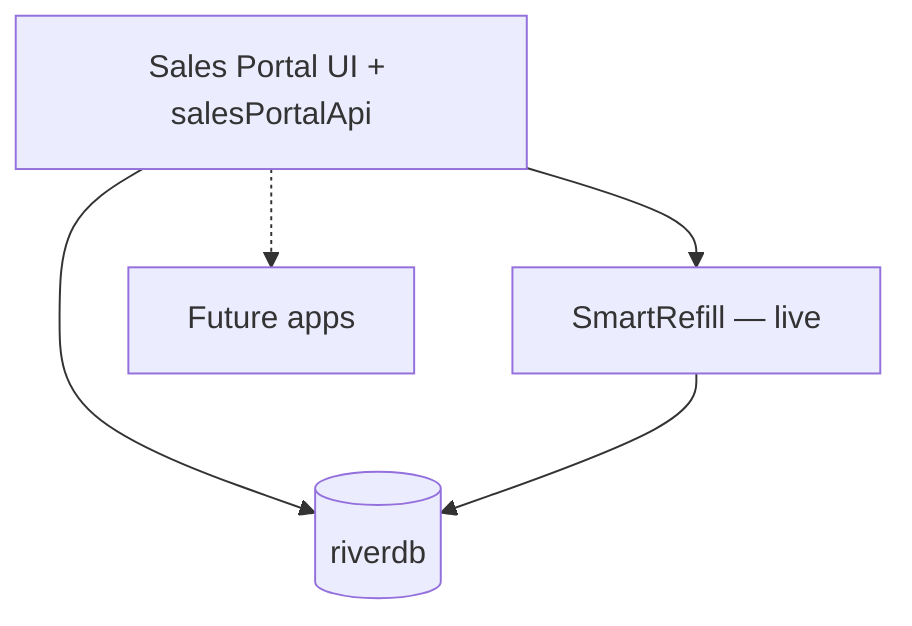
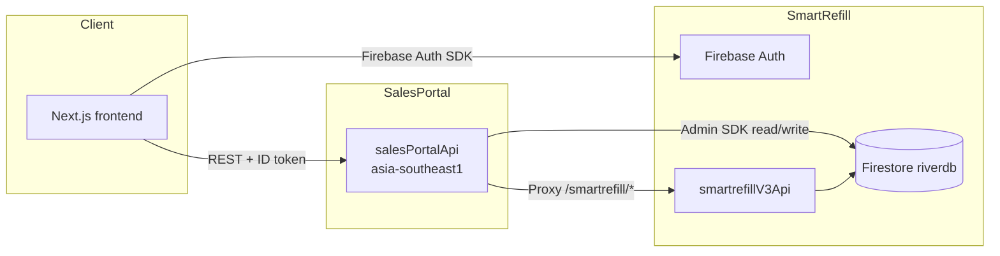

# Architecture overview

Sales Portal v2 is a **monorepo** with a dedicated Next.js frontend and a Firebase Cloud Functions API (`salesPortalApi`). It is River’s **internal sales and platform operations hub** — not a SmartRefill-only tool. It reads shared platform data from Firestore (`riverdb`) and integrates product apps over time; **SmartRefill is the first integrated app**.

## Platform model (multi-app)

- **Identity:** Firebase Auth + `users/{uid}` in `riverdb`
- **Access:** `users.appAccess` array — one entry per app (`sales-portal`, `smartrefill`, future apps)
- **Sales Portal roles:** `sales`, `manager`, `admin` (app id `sales-portal`)
- **Product apps:** Each app has its own API integration (e.g. `ALL /smartrefill/*` proxy today)



## System diagram



## Responsibilities

| Layer | Owns | Does not own |
|-------|------|--------------|
| **Frontend** | UI, formatting, client auth, API client calls | Direct Firestore writes for business data, SmartRefill business rules |
| **salesPortalApi** | Auth gate (`appAccess`), dashboard analytics, admin tools, Content Studio AI, SmartRefill proxy | SmartRefill workspace CRUD (delegated via proxy) |
| **SmartRefill V3** | Owner/staff product, workspaces, subscriptions lifecycle | Sales Portal roles (`sales`, `manager`, `admin`) |

## Hybrid read model

- **Dashboard analytics** — aggregated in `salesPortalApi` via Firebase Admin SDK (users, businesses, login events, subscriptions).
- **Admin data management** — Admin SDK reads/writes on `riverdb` with server-side authorization.
- **SmartRefill product data** — proxied through `ALL /smartrefill/*` with the caller’s Firebase ID token.

The frontend does **not** use Firestore client SDK for analytics; it calls `GET /dashboard/analytics`.

## Shared Firestore (`riverdb`)

Canonical rules and indexes live in **`smartrefill/frontend/firestore.rules`**. Sales Portal copies are synced via:

```bash
cd backend && npm run sync:firestore && npm run check:firestore
```

Sales Portal–specific paths include `sales/{uid}`, `users.appAccess.sales-portal`, and admin catalog collections (`subscription_plans`, `subscription_addons`, etc.).

## Tech stack

| Area | Stack |
|------|--------|
| Frontend | Next.js 16, React 19, Tailwind CSS 4, Firebase Auth client |
| Backend | Node 22, Express, firebase-functions v2, firebase-admin |
| AI | Gemini (Content Studio, dashboard insights) via `SALES_PORTAL_GEMINI_API_KEY` |
| Hosting | Firebase App Hosting (`frontend/apphosting.yaml`) + Cloud Functions |

## Local development ports

| Service | URL |
|---------|-----|
| Frontend | `http://127.0.0.1:9002` |
| Sales Portal API (local) | `http://127.0.0.1:8071` |
| Functions emulator | `http://127.0.0.1:5001/.../salesPortalApi` |
| Firestore emulator | `http://127.0.0.1:8080` |

## Deployment

- **API:** `backend/deploy.sh` — build, unit tests, lint, optional Firestore deploy, Cloud Functions.
- **Frontend:** Firebase App Hosting from `frontend/` (see [frontend-documentation.md](./frontend-documentation.md)).
