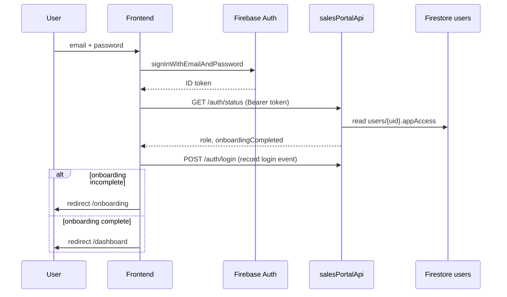

# Auth flow

Sales Portal uses **Firebase Authentication** for identity and **`users.appAccess`** in Firestore (`riverdb`) for app-specific roles.

## App identifier

- **App ID:** `sales-portal` (`SALES_PORTAL_APP_ID` in backend)
- **Roles:** `sales`, `manager`, `admin`

## Login sequence

## Access rules

1. User must exist in Firebase Auth.
2. User document in `users/{uid}` must include `appAccess.sales-portal` with a valid role.
3. `GET /auth/status` returns `403` with `NO_SALES_PORTAL_ACCESS` if missing.
4. Protected API routes use `validateFirebaseIdToken` + `requireSalesPortalAccess`.

## Onboarding

New users with portal access but incomplete onboarding:

1. `/onboarding` — password reset (if required)
2. `/onboarding/complete-setup` — profile (display name, phone, birthday, avatar)
3. Role-specific fields: **sales** → team; **manager** → location
4. `POST /onboarding/complete` writes `sales/{uid}` and sets `onboardingCompleted`

## Admin permissions

Admins manage portal access at **`/admin/permissions`**:

- `PATCH /admin/users/:uid/app-access` — grant/revoke roles
- Bulk user management under `/admin`

## Frontend helpers

| Module | Purpose |
|--------|---------|
| `lib/firebase/auth.ts` | Firebase Auth instance |
| `lib/auth-status.ts` | `fetchAuthStatus`, `resolvePostLoginPath` |
| `lib/api-client.ts` | Authenticated fetch to Sales Portal API |

## App Check (production)

Frontend uses reCAPTCHA v3 + Firebase App Check (`NEXT_PUBLIC_RECAPTCHA_SITE_KEY`). Local dev may set `NEXT_PUBLIC_APPCHECK_DEBUG_TOKEN` (register in Firebase Console).

**Hosting domains that must stay allowlisted:**

| Config | Domains |
|--------|---------|
| Firebase Auth → Authorized domains | `sales-river-tech.web.app`, `sales-river-tech.firebaseapp.com`, `sales-portal--aquaflow-management-suite.asia-southeast1.hosted.app` |
| reCAPTCHA Enterprise key `sales-portal` (`6LcEChst…`) allowed domains | same three (+ `localhost`) |

If Auth logs `appCheck/recaptcha-error` or the browser reports a CORS failure on `/auth/status` from a new host, add that host to **both** lists above (CORS on the API already reflects any origin; the browser often mislabels Auth/App Check failures as CORS).

## Manual QA

See [frontend-test-cases.md](./frontend-test-cases.md) — **TC-AUTH-*** cases.

Automated coverage: [testing-test-summary.md](./testing-test-summary.md) (auth integration/BDD planned).
